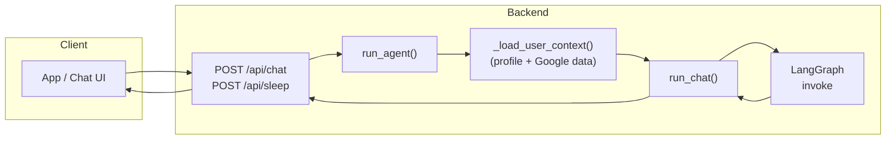
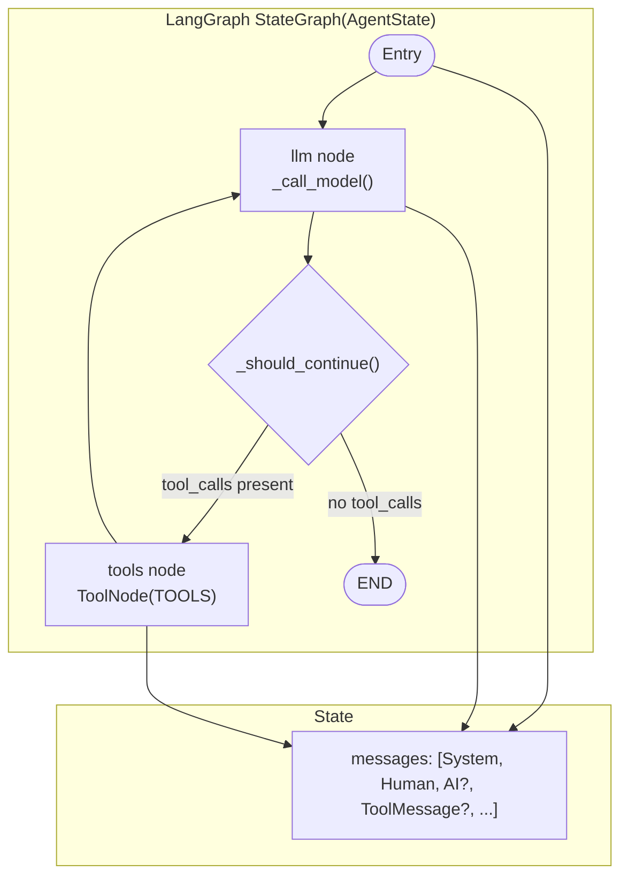
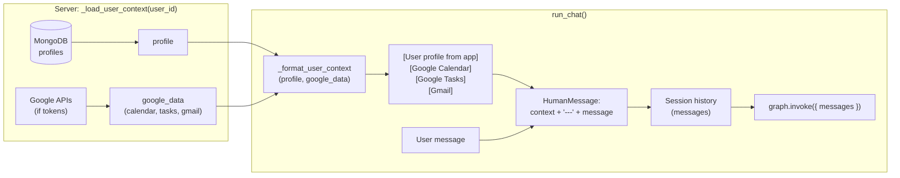
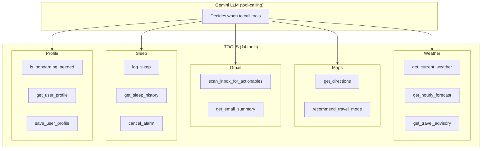
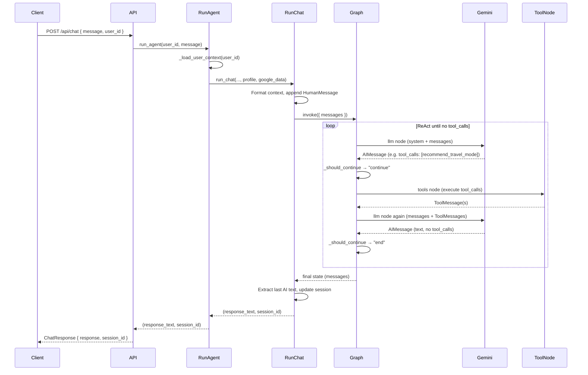

# Agent Orchestration Flow

Flow diagrams for the Day Planner agent: LangGraph + Gemini, context loading, and tool use.

---

## 1. High-level request flow

- **Client** sends a message (or sleep time) to the backend.
- **Backend** loads profile + Google (Calendar, Tasks, Gmail), then runs the agent with that context.
- **run_chat** injects context into the user message, keeps session history, and invokes the LangGraph once per turn.

---

## 2. LangGraph ReAct loop (agent core)

- **State:** Single key `messages` (sequence of System, Human, AI, ToolMessage); `add_messages` appends new messages.
- **Entry** is the `llm` node.
- **llm:** Builds `[SystemMessage(SYSTEM_INSTRUCTION)] + state.messages`, calls **Gemini (ChatGoogleGenerativeAI)** with `bind_tools(TOOLS)`, returns one `AIMessage` (text and/or `tool_calls`).
- **_should_continue:** If the last message is an `AIMessage` with `tool_calls` → go to **tools**; otherwise → **END**.
- **tools:** `ToolNode(TOOLS)` runs the requested tools and returns `ToolMessage`s; then the graph goes back to **llm**.
- Loop continues until the model responds with no `tool_calls`, then the run ends.

---

## 3. Context injection and session

- **Profile** and **google_data** come from DB and (optionally) live Google APIs.
- **run_chat** turns them into a single context block and prepends it to the user message (`context + "\n\n---\nUser: " + message`), then appends a **HumanMessage** to the session **messages**.
- The same **messages** (with history) are passed to **graph.invoke**; the graph may add multiple AI and Tool messages in one turn.

---

## 4. Tool categories and usage

- The **LLM** receives a system instruction that describes all tools and when to use them (day planning, travel, weather, sleep, profile).
- **ToolNode** executes only the tools referenced in the last `AIMessage.tool_calls`; results are added as **ToolMessage**s and the next **llm** call sees them in **messages**.

---

## 5. Single-turn flow (with one tool round)

- One **POST /api/chat** can trigger several **llm** and **tools** steps inside a single **graph.invoke**.
- Session history is updated from the graph’s final **messages** and reused on the next request with the same **session_id**.

---

## 6. Triggers that use the same agent

| Trigger              | Entry point        | Context source              |
|----------------------|--------------------|-----------------------------|
| User chat / day plan | POST /api/chat     | _load_user_context(user_id) |
| Sleep log            | POST /api/sleep    | same                        |
| Morning alarm (cron) | trigger_morning_plan | same                      |

The same **run_agent → run_chat → LangGraph** path is used; only the prompt and (for sleep) post-processing (e.g. alarm scheduling) differ.
