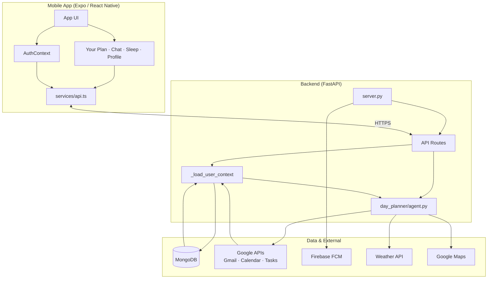
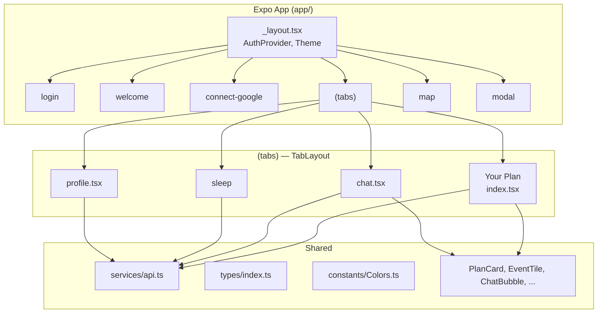
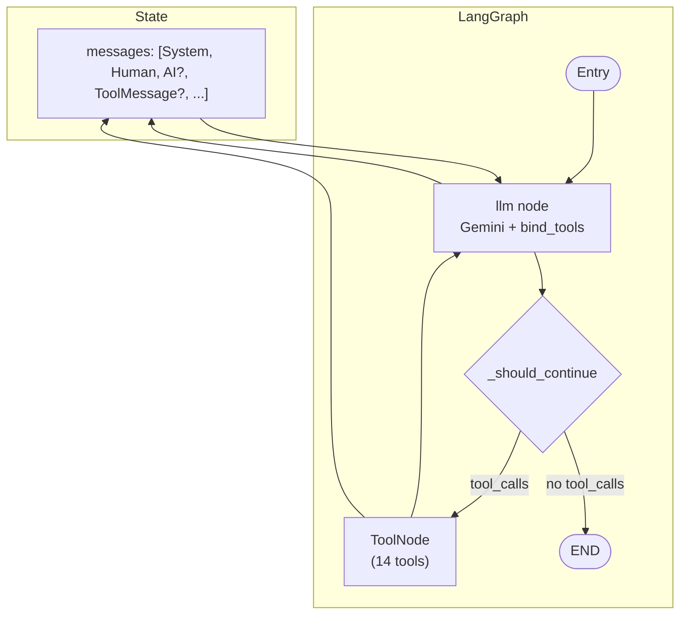
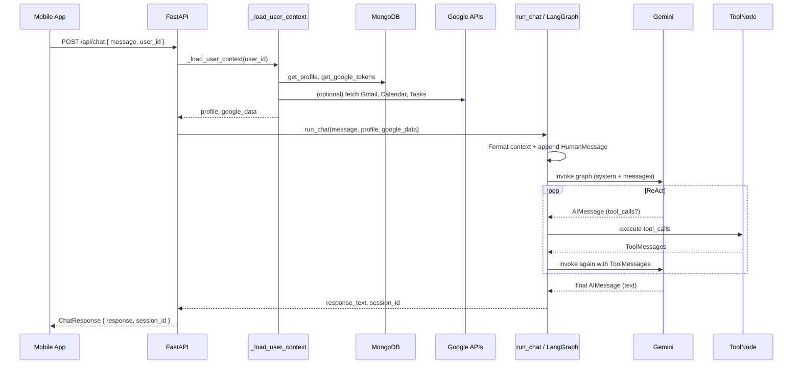

# GDG Hackfest AI Day Planner — Architecture

High-level architecture for the Day Planner: Expo mobile app, FastAPI backend, LangGraph + Gemini agent, MongoDB, Google APIs, and Firebase.

---

## 1. System overview




- **Client:** Expo app with tab navigation (Your Plan, Chat, Sleep, Profile), auth (login/register), and a central API client.
- **Backend:** FastAPI server that loads user context (profile + Google data) and runs the LangGraph + Gemini agent.
- **Data:** MongoDB for users, profiles, and Google tokens; Google for Gmail/Calendar/Tasks and Maps; Firebase for push notifications; weather and maps used by the agent.

---

## 2. Backend architecture

```mermaid
StateGraph
flowchart LR
    subgraph API["FastAPI (server.py)"]
        Chat["POST /api/chat"]
        Sleep["POST /api/sleep"]
        Profile["POST /api/profile"]
        Auth["/api/register\n/api/login"]
        Google["/api/google/*"]
        Plan["/api/plan/add-to-calendar"]
        FCM["/api/fcm-token\n/api/notify"]
        Health["GET /api/health"]
    end

    subgraph Agent["LangGraph Agent"]
        LoadCtx[_load_user_context]
        RunChat[run_chat]
        Graph[StateGraph]
        LLM[Gemini LLM]
        Tools[ToolNode]
        LoadCtx --> RunChat
        RunChat --> Graph
        Graph --> LLM
        LLM --> Tools
        Tools --> LLM
    end

    subgraph Infra["Infrastructure"]
        DB[(MongoDB)]
        Scheduler[APScheduler]
        FCM_Svc[Firebase FCM]
    end

    Chat --> LoadCtx
    Sleep --> LoadCtx
    Profile --> DB
    Auth --> DB
    Google --> DB
    Plan --> Google
    Scheduler --> RunChat
    RunChat --> FCM_Svc
```


- **API:** Chat and sleep go through the agent; profile, auth, Google OAuth/sync, add-to-calendar, FCM, and health are separate routes.
- **Agent:** Context is loaded (profile + Google), then `run_chat` runs the LangGraph (LLM + tools) and returns the reply.
- **Infra:** MongoDB for persistence; APScheduler for morning alarms; Firebase for push notifications.

---

## 3. Mobile app structure




- **Root:** Auth-gated navigation; redirects to login → welcome (onboarding) or connect-google → (tabs).
- **Tabs:** Your Plan (day plan + map), Chat (agent), Sleep (log + alarm), Profile (settings + Google link).
- **Shared:** Single API client, types, theme, and reusable components.

---

## 4. Agent flow (LangGraph + Gemini)




- **State:** Single `messages` list (system, user, assistant, tool messages); reducer appends new messages.
- **Flow:** Entry → LLM → if tool_calls → ToolNode → back to LLM; else END.
- **Tools:** Weather (3), Maps (2), Gmail (2), Sleep (3), Profile (3), etc. — all invoked by the LLM via tool_calls.

---

## 5. Data flow (request → response)




- One chat request triggers context load (DB + optional Google), then a single `run_chat` → graph invoke; the graph may run multiple LLM/tool steps (ReAct) before returning the final text.

---

## 6. Key files


| Layer       | Path                             | Purpose                                                                  |
| ----------- | -------------------------------- | ------------------------------------------------------------------------ |
| Backend API | `backend/server.py`              | FastAPI app, routes, CORS, scheduler, FCM, _load_user_context, run_agent |
| Agent       | `backend/day_planner/agent.py`   | LangGraph StateGraph, Gemini, tools, run_chat, session history           |
| DB          | `backend/db.py`                  | MongoDB connection, users, profiles, google_tokens                       |
| Tools       | `backend/day_planner/tools/*.py` | weather, gmail, sleep, profile, maps                                     |
| Mobile API  | `mobile/services/api.ts`         | All backend calls (chat, sleep, profile, auth, Google, FCM, etc.)        |
| Root layout | `mobile/app/_layout.tsx`         | AuthProvider, Stack (login, welcome, connect-google, (tabs), map, modal) |
| Tabs        | `mobile/app/(tabs)/_layout.tsx`  | Tab bar: Your Plan, Chat, Sleep, Profile                                 |


For detailed agent orchestration (context injection, tool list, single-turn flow), see [AGENT_ORCHESTRATION_FLOW.md](./AGENT_ORCHESTRATION_FLOW.md).