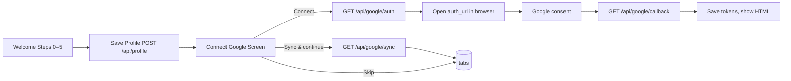
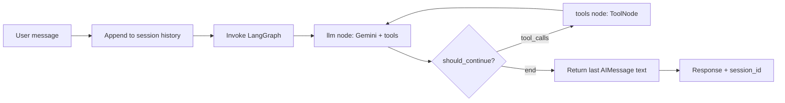
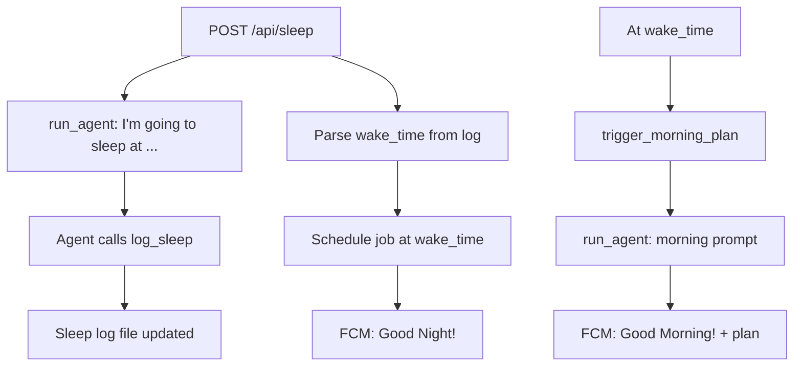

# Day Planner — Full Flow Documentation

This document describes the end-to-end flows of the **GDG Hackfest AI Day Planner** app: auth, onboarding, Google connection, chat agent, sleep/alarm, and APIs.

---

## 1. High-Level Architecture

```
┌─────────────────────────────────────────────────────────────────────────────┐
│                           MOBILE APP (React Native / Expo)                    │
│  login → welcome → connect-google → (tabs): Home / Chat / Profile            │
└─────────────────────────────────────────────────────────────────────────────┘
                    │
                    │ HTTPS (user_id in body/query; no JWT)
                    ▼
┌─────────────────────────────────────────────────────────────────────────────┐
│                         BACKEND (FastAPI, Python)                             │
│  • Auth (register/login)     • Profile CRUD     • Google OAuth + sync         │
│  • Chat → LangGraph+Gemini  • Sleep + scheduler • FCM push                   │
└─────────────────────────────────────────────────────────────────────────────┘
        │                    │                              │
        ▼                    ▼                              ▼
┌──────────────┐   ┌─────────────────┐   ┌──────────────────────────────────┐
│   MongoDB    │   │  Firebase FCM   │   │  Google APIs (per-user OAuth)     │
│  users       │   │  Push tokens    │   │  Gmail, Calendar, Tasks           │
│  profiles    │   │  (file-backed)   │   │  + Gemini (GOOGLE_API_KEY)       │
│  google_     │   │                 │   │  + OpenWeather (optional)         │
│  tokens      │   │                 │   │                                  │
│  sleep_logs  │   │                 │   │                                  │
└──────────────┘   └─────────────────┘   └──────────────────────────────────┘
```

- **No Google ADK.** Agent is **LangGraph + Gemini** (ChatGoogleGenerativeAI) with tool calling.
- **Auth:** Email/password; `user` (including `user_id`) is stored in AsyncStorage and sent in requests.
- **Google data:** Per-user OAuth tokens in MongoDB; Gmail/Calendar/Tasks fetched via backend (LangGraph sync or direct).

---

## 2. Authentication Flow

### 2.1 App startup and routing

1. App loads → **AuthProvider** reads `user` from **AsyncStorage** (`'user'` key).
2. **AuthRedirect** (in root layout):
   - If `loading`: do nothing.
   - If no `user` → **replace to `/login`**.
   - If `user` exists → **GET /api/profile/{user_id}**:
     - Success → **replace to `/(tabs)`** (main app).
     - 404/failure → **replace to `/welcome`** (onboarding).

### 2.2 Register

| Step | Where | What |
|------|--------|-----|
| 1 | Mobile: `login.tsx` (signup mode) | User enters email, password, name → **api.register(email, password, name)** |
| 2 | Backend: **POST /api/register** | `db.register_user()`: check email unique, hash password (SHA-256 + salt), insert into **MongoDB `users`**, return `{ user_id, email, name }`. |
| 3 | Mobile: AuthContext | Store returned `user` in state and **AsyncStorage.setItem('user', …)**. |
| 4 | Mobile: login.tsx | **router.replace('/welcome')** (new users go to onboarding). |

### 2.3 Login

| Step | Where | What |
|------|--------|-----|
| 1 | Mobile: `login.tsx` (login mode) | **api.login(email, password)** |
| 2 | Backend: **POST /api/login** | `db.login_user()`: verify password, return `{ user_id, email, name }` or 401. |
| 3 | Mobile | Store `user` in state + AsyncStorage. **router.replace('/(tabs)')** or **router.replace('/welcome')** depending on flow. |

- **No JWT or cookies.** Client identifies the user by sending `user_id` in request bodies (e.g. chat, sleep, profile) or query params (e.g. Google status/sync).

---

## 3. Onboarding and Profile Flow

### 3.1 Welcome (multi-step form)

- **Screen:** `mobile/app/welcome.tsx`.
- **Steps:** 0: Name → 1: State & City → 2: Addresses → 3: Schedule → 4: Lifestyle → 5: Goals & Sleep.
- On **“Let’s Go!”** (last step):
  1. Build profile payload (name, state, city, home_address, office_address, work_hours, energy_type, peak_focus_hours, transport, exercise, bedtime, wake_time, hobbies, goals).
  2. **POST /api/profile** with `user_id` from `useAuth().user` and the payload.
  3. Backend **save_profile(user_id, profile_data)** → MongoDB **`profiles`** (upsert by `user_id`).
  4. **router.replace('/connect-google')** (next step: link Google).

### 3.2 Connect Google (after profile is stored)

- **Screen:** `mobile/app/connect-google.tsx`.
- **GET /api/google/status?user_id=…** → show “Connected” or “Not connected”.
- **Connect with Google:**
  1. **GET /api/google/auth?user_id=…** → backend returns **auth_url** (Google OAuth consent URL, `state=user_id`).
  2. Mobile opens **auth_url** in system browser (e.g. `Linking.openURL(auth_url)`).
  3. User signs in with Google and consents; Google redirects to **GET /api/google/callback?code=…&state=user_id**.
  4. Backend exchanges `code` for tokens, **save_google_tokens(user_id, tokens)** → MongoDB **`google_tokens`**, returns HTML “Connected” page.
  5. User closes browser; in app they tap “I’ve connected — refresh status” or “Sync & continue”.
- **Sync & continue:** **GET /api/google/sync?user_id=…** (optional), then **router.replace('/(tabs)')**.
- **Skip for now:** **router.replace('/(tabs)')** without syncing.

### 3.3 Profile tab

- **GET /api/profile/{user_id}** to load, **POST /api/profile** to save.
- Card: “Google (Gmail, Calendar, Tasks)” with status from **GET /api/google/status**; tap → **router.push('/connect-google')**.

---

## 4. Google OAuth and Sync Flow (Detail)

### 4.1 OAuth (Gmail, Calendar, Tasks) — no credentials.json required

Google data is pulled in **dynamically** per user. Two options:

**Option A — Server builds auth URL (no credentials.json):**

- Set **GOOGLE_CLIENT_ID** in env (and optionally **GOOGLE_CLIENT_SECRET** for Web client). Create an OAuth 2.0 Client in [Google Cloud Console](https://console.cloud.google.com/apis/credentials) (e.g. “Desktop app” or “Web application”). For Desktop app, client_secret is optional for code exchange.
- **redirect_uri** = `{BACKEND_URL}/api/google/callback` (set **BACKEND_URL** in env).
- **Flow:** **GET /api/google/auth?user_id=…** → backend builds **auth_url** with client_id only → user opens URL → Google redirects to **/api/google/callback?code=…&state=user_id** → backend exchanges code (with client_id ± client_secret) → **save_google_tokens(user_id, tokens)**. No **credentials.json** file needed.

**Option B — App sends tokens (fully dynamic):**

- App does Google OAuth on the client (e.g. Expo AuthSession, Google Sign-In) and obtains **access_token** and **refresh_token**.
- App sends them to backend: **POST /api/google/tokens** with `{ user_id, access_token, refresh_token, expiry? }`.
- Backend stores tokens and uses them for Gmail/Calendar/Tasks. Set **GOOGLE_CLIENT_ID** (and optionally **GOOGLE_CLIENT_SECRET**) in env so the backend can refresh tokens when they expire.

- **Scopes:** `gmail.readonly`, `calendar`, `calendar.events`, `tasks`, `tasks.readonly`.

### 4.2 Google Sync (Gmail + Calendar + Tasks)

- **GET /api/google/sync?user_id=…**:
  - Requires **get_google_tokens(user_id)** to be set (i.e. OAuth done).
  - Prefer **LangGraph** pipeline: **day_planner/google_sync_graph.run_google_sync(user_id)**:
    - Graph: **gmail** → **calendar** → **tasks** → END (each node calls **google_services** fetch for that user).
  - Fallback (if LangGraph fails): direct calls to **fetch_gmail_summary**, **fetch_calendar_events**, **fetch_google_tasks**.
  - Returns **{ gmail, calendar, tasks }** (each a dict with list of items or error).

- **Per-user APIs:** `day_planner/google_services.py` builds Gmail/Calendar/Tasks clients from **get_google_tokens(user_id)**; refreshes tokens when expired and persists back to DB.

---

## 5. Chat Agent Flow (LangGraph + Gemini)

### 5.1 Request path

1. Mobile: user sends a message → **POST /api/chat** with **{ message, user_id, session_id }**.
2. Backend: **run_agent(user_id, message, session_id)** runs **run_chat(…)** in a thread pool (sync LangGraph run from async FastAPI).
3. **day_planner.agent.run_chat(user_id, message, session_id)**:
   - Ensures **session_id** (create new if empty).
   - Appends **HumanMessage(content=message)** to **session history** (in-memory **\_session_messages[session_id]**).
   - Invokes **compiled LangGraph** with **state = { messages: history }**.
   - Graph runs until the last message is an **AIMessage** with text (no tool_calls).
   - Session history is updated with all new messages (AIMessage + ToolMessages); final AI text is returned.
4. Response: **{ response, session_id }**. Optionally, if response mentions alarm/wake, backend may **\_schedule_alarm_from_response(user_id, response)**.

### 5.2 LangGraph structure

- **State:** `AgentState = { messages: Annotated[Sequence[BaseMessage], add_messages] }`.
- **Nodes:**
  - **llm:** Invokes **ChatGoogleGenerativeAI** (Gemini 2.0 Flash) with **system instruction** + **state["messages"]**, with **.bind_tools(TOOLS)**. Returns **AIMessage** (possibly with **tool_calls**).
  - **tools:** **ToolNode(TOOLS)** executes each tool call from the last message and returns **ToolMessage**s.
- **Edges:**
  - Entry → **llm**.
  - **llm** → **should_continue**:
    - If last message has **tool_calls** → **tools**.
    - Else → **END**.
  - **tools** → **llm** (loop).

So the flow is: **User message → LLM → [optional: tool calls → ToolNode → LLM again] → final text**.

### 5.3 Tools available to the agent

| Tool | Purpose |
|------|--------|
| get_current_weather(city) | Current weather (OpenWeatherMap; USER_CITY env if city empty). |
| get_hourly_forecast(city) | Hourly forecast for today. |
| get_travel_advisory(city) | Recommend bike/car/stay-in from weather. |
| scan_inbox_for_actionables(hours) | Gmail: deadlines, travel, meetings, action items (file/token-backed or per-user if wired). |
| get_email_summary(max_emails) | Recent unread email summaries. |
| log_sleep(bedtime) | Log bedtime; returns wake time (from **sleep_tools**; uses file **sleep_log.json**). |
| get_sleep_history(days) | Past N days sleep log. |
| cancel_alarm() | Request alarm cancellation. |
| is_onboarding_needed() | Check if profile onboarding needed (file **user_profile.json**). |
| get_user_profile() | Get current profile from file. |
| save_user_profile(...) | Save profile fields to file. |

(Profile and sleep tools currently use **day_planner/data/** JSON files; MongoDB profile is used by **/api/profile** and welcome screen.)

---

## 6. Sleep and Morning Alarm Flow

### 6.1 Logging sleep and scheduling alarm

1. Mobile: user submits bedtime → **POST /api/sleep** with **{ bedtime, user_id }**.
2. Backend builds message: **“I’m going to sleep at {bedtime}”** → **run_agent(user_id, message)** (same LangGraph agent).
3. Agent may call **log_sleep(bedtime)** (in **sleep_tools**), which writes to **sleep_log.json** and returns wake time.
4. Backend then:
   - Reads **sleep_tools._load_sleep_log()**, takes latest entry, parses **wake_time** (or **wake_time_iso**).
   - Schedules **APScheduler** job: **trigger_morning_plan(user_id)** at that **wake_time** (job_id = **morning_alarm_{user_id}**).
   - Sends FCM: “Good Night!”, “Alarm set for …”.
5. Response: **{ response, wake_time, alarm_scheduled, session_id }**.

### 6.2 Morning plan (alarm trigger)

- At **wake_time**, scheduler runs **trigger_morning_plan(user_id)**:
  1. Builds prompt: “It’s morning! The user just woke up. Start with a warm affirmation… Then create their full day plan…”
  2. **run_agent(user_id, prompt)** → agent can use weather, profile, Gmail, etc., and returns a plan.
  3. **send_push_notification(user_id, "Good Morning!", "Your day plan is ready...", data={ plan: response[:500] })**.

### 6.3 Manual morning plan

- **POST /api/morning-plan?user_id=…** triggers the same **trigger_morning_plan(user_id)** (e.g. for testing or Cloud Scheduler).

---

## 7. Push Notifications (FCM)

- **POST /api/fcm-token**: body **{ token, user_id }** → store in **day_planner/data/fcm_tokens.json** (in-memory dict persisted to file).
- **send_push_notification(user_id, title, body, data)** uses **firebase_admin.messaging.send()** with that token.
- **POST /api/notify**: test endpoint to send a notification to a **user_id**.

---

## 8. API Reference (Backend)

| Method | Path | Purpose |
|--------|------|--------|
| POST | /api/register | Register (email, password, name) → user in DB. |
| POST | /api/login | Login → returns user. |
| POST | /api/chat | Chat message → LangGraph+Gemini → { response, session_id }. |
| POST | /api/sleep | Log bedtime → agent + schedule morning alarm + FCM. |
| POST | /api/morning-plan | Trigger morning plan (query: user_id). |
| POST | /api/fcm-token | Register FCM token for user_id. |
| POST | /api/notify | Send test notification (body: title, body, user_id). |
| GET | /api/health | Health + agent/model info. |
| POST | /api/profile | Save profile (body: user_id + profile fields). |
| GET | /api/profile/{user_id} | Get profile. |
| GET | /api/google/auth | Get Google OAuth URL (query: user_id). |
| GET | /api/google/callback | OAuth callback (code, state=user_id) → save tokens, HTML. |
| GET | /api/google/status | { connected: bool } (query: user_id). |
| GET | /api/google/sync | Gmail + Calendar + Tasks for user (query: user_id). |
| POST | /api/google/tokens | Store tokens from client-side OAuth (body: user_id, access_token, refresh_token?, expiry?). |

---

## 9. Data Stores

### 9.1 MongoDB (db.py)

- **users:** email (unique), user_id, name, password_hash, password_salt, created_at.
- **profiles:** user_id (unique), profile fields (name, addresses, work_hours, energy_type, transport, exercise, bedtime, wake_time, hobbies, goals, etc.), updated_at, created_at.
- **google_tokens:** user_id (unique), tokens (dict), updated_at, created_at.
- **sleep_logs:** user_id, bedtime, wake_time, logged_at (used by **db** helpers; agent’s **sleep_tools** use file).

### 9.2 Backend files

- **day_planner/data/sleep_log.json** — used by **sleep_tools** (log_sleep, get_sleep_history).
- **day_planner/data/user_profile.json** — used by **profile_tools** (get/save for agent).
- **day_planner/data/fcm_tokens.json** — user_id → FCM token.
- **backend/credentials.json** — Google OAuth client (for Gmail/Calendar/Tasks).
- **backend/firebase_config.json** — Firebase Admin SDK for FCM.

### 9.3 Mobile

- **AsyncStorage** key **'user'**: **{ user_id, email, name }** (no server-side session; client sends user_id).

---

## 10. Flow Diagrams (Mermaid)

### 10.1 App entry and auth

```mermaid
flowchart TD
    A[App Start] --> B{User in AsyncStorage?}
    B -->|No| C[Login Screen]
    B -->|Yes| D[GET /api/profile]
    C --> E[Register or Login]
    E --> F[Store user, AsyncStorage]
    F --> G[Replace /welcome]
    D -->|OK| H[Replace /(tabs)]
    D -->|404/fail| G
```

### 10.2 Onboarding and Google connect



### 10.3 LangGraph agent (chat)



### 10.4 Sleep and morning alarm



---

## 11. Environment and Config

- **Backend** (e.g. **day_planner/.env**):
  - **GOOGLE_API_KEY** or **GEMINI_API_KEY** — Gemini for the agent.
  - **BACKEND_URL** — Base URL for OAuth redirect (e.g. `https://your-api.com`).
  - **GOOGLE_CLIENT_ID** — OAuth 2.0 Client ID (Desktop or Web) from Cloud Console. Enables auth URL and code exchange **without credentials.json**.
  - **GOOGLE_CLIENT_SECRET** — Optional; required for some Web clients, optional for Desktop app.
  - **OPENWEATHER_API_KEY**, **USER_CITY** — optional, for weather tools.
- **Google Cloud Console:** Create an OAuth 2.0 Client (Desktop app or Web). Add redirect URI **{BACKEND_URL}/api/google/callback** if using server callback. **credentials.json** is optional when **GOOGLE_CLIENT_ID** is set.
- **Firebase:** **firebase_config.json** for FCM.

---

This is the full flow of the app as of the current implementation (LangGraph + Gemini, no Google ADK, with per-user Google OAuth and sync).
