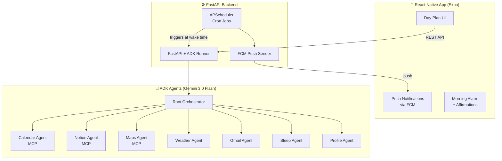
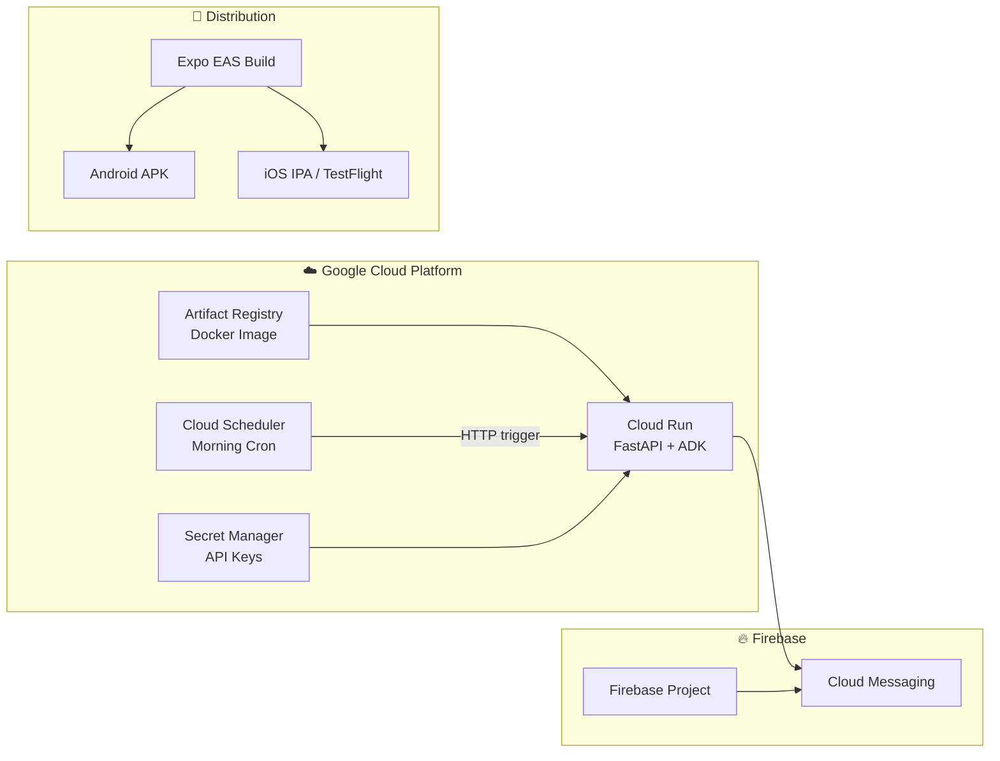

# Agentic Day Planner — Final Implementation Plan

**Google ADK + Gemini 3.0 Flash + MCP + Flutter + Firebase**

An intelligent multi-agent mobile app that collects data from Google Calendar, Gmail, Notion, and weather, then generates an optimized daily schedule with route planning, weather-aware travel, sleep-based replanning, proactive morning alarms with affirmations, and push notifications for every event.

---

## Architecture



### Tech Stack

| Layer | Technology | Why |
|---|---|---|
| **Mobile** | React Native (Expo) | Cross-platform, fast iteration, JS/TS ecosystem |
| **Notifications** | Firebase Cloud Messaging (FCM) | Real push notifications for events, alarms, reminders |
| **Backend** | FastAPI wrapping ADK via `get_fast_api_app` | Serves agent as REST API for mobile consumption |
| **Scheduler** | APScheduler (`AsyncIOScheduler`) | Proactive morning alarm + day plan trigger |
| **Agents** | Google ADK with `gemini-3.0-flash` | Multi-agent orchestration |
| **MCP** | Maps, Calendar, Notion MCP servers | External tool integration |

---

## Project Structure

```
GDG-hackathon/
├── backend/
│   ├── day_planner/                # ADK agent package
│   │   ├── __init__.py
│   │   ├── agent.py                # Root + 7 sub-agents
│   │   ├── tools/
│   │   │   ├── __init__.py
│   │   │   ├── weather_tools.py
│   │   │   ├── gmail_tools.py
│   │   │   ├── sleep_tools.py
│   │   │   └── profile_tools.py
│   │   ├── data/
│   │   │   ├── user_profile.json
│   │   │   ├── sleep_log.json
│   │   │   └── plan_history.json
│   │   └── .env
│   ├── server.py                   # FastAPI + scheduler + FCM
│   ├── firebase_config.json        # FCM service account
│   ├── credentials.json            # Google OAuth
│   └── requirements.txt
├── mobile/                         # React Native (Expo)
│   ├── app/
│   │   ├── (tabs)/
│   │   │   ├── index.tsx           # Day plan view
│   │   │   ├── chat.tsx            # Agent chat interface
│   │   │   ├── profile.tsx         # Onboarding + settings
│   │   │   └── sleep.tsx           # Bedtime input
│   │   └── _layout.tsx             # Tab navigator
│   ├── components/
│   │   ├── PlanCard.tsx
│   │   ├── EventTile.tsx
│   │   └── AffirmationCard.tsx
│   ├── services/
│   │   ├── api.ts                  # Backend REST calls
│   │   ├── notifications.ts        # FCM handler
│   │   └── alarm.ts                # Local alarm trigger
│   ├── types/
│   │   └── index.ts                # DayPlan, Event types
│   ├── app.json
│   ├── package.json
│   └── google-services.json
└── README.md
```

---

## Agent System (7 Sub-Agents)

All use `gemini-3.0-flash` as the model.

### MCP Agents (3)
| Agent | MCP Server | Purpose |
|---|---|---|
| Calendar | Google Calendar MCP | Events, free slots, create events with reminders |
| Notion | `@suekou/mcp-notion-server` | Pull todos by status/priority/due date |
| Maps | `@modelcontextprotocol/server-google-maps` | Directions, route optimization, travel mode |

### Function Tool Agents (4)
| Agent | Tools | Purpose |
|---|---|---|
| Weather | `get_current_weather()`, `get_hourly_forecast()`, `get_travel_advisory()` | Forecast + bike/car advisory |
| Gmail | `scan_inbox_for_actionables()`, `get_email_summary()` | Deadlines, travel confirmations, action items |
| Sleep | `log_sleep()`, `get_sleep_history()`, `cancel_alarm()` | Sleep logging, triggers scheduler |
| Profile | `get_user_profile()`, `save_user_profile()`, `is_onboarding_needed()` | Preferences, energy type, locations |

---

## Push Notifications (FCM)

Every planned event gets a push notification. The backend uses `firebase-admin` to send targeted notifications.

| Notification | When | Content |
|---|---|---|
| 🌅 **Morning alarm** | Wake time (from sleep target) | Affirmation + "Your day plan is ready" |
| 📅 **Event reminder** | X min before each event (user-configurable) | "Meeting with team in 15 min" |
| 🚗 **Travel alert** | Before travel-required events | "Leave now — 25 min drive to dentist" |
| 🌧️ **Weather change** | When forecast changes | "Rain starting at 2 PM — switch to car" |
| ✅ **Todo reminder** | Scheduled todo time | "Time to study for exam (2h block)" |
| 😴 **Bedtime nudge** | Sleep target time minus sleep hours | "Time to wind down — bedtime in 30 min" |

---

## Key Flows

### Proactive Morning (Auto-Triggered)
```
⏰ NIGHT: User opens sleep screen → taps "Going to sleep"
  → Backend logs bedtime, reads sleep_target (7.5h)
  → APScheduler sets cron for 7:00 AM
  → Calendar alarm event created

⏰ 7:00 AM: Scheduler fires (no user action)
  → FCM push: alarm notification on phone
  → Gemini generates personalized affirmation
  → Auto-runs: Calendar → Gmail → Notion → Weather → Maps
  → Generates optimized day plan
  → Creates calendar events with reminders
  → Schedules FCM push for EVERY event
  → FCM push: "Good morning! Your plan is ready 📋"
```

### Real-Time Event Notifications
```
Plan created with 6 events:
  8:00 AM - Focus block (study)     → FCM at 7:45 AM
  10:00 AM - Team meeting           → FCM at 9:45 AM
  12:00 PM - Lunch                  → no notification
  2:00 PM - Dentist                 → FCM at 1:30 PM + travel alert
  4:00 PM - Grocery                 → FCM at 3:50 PM
  6:00 PM - Gym                     → FCM at 5:45 PM
  10:30 PM - Bedtime nudge          → FCM at 10:00 PM
```

---

## Mobile App Screens

### 1. Home — Day Plan View
- Time-blocked schedule cards with color-coded categories
- Weather bar at top
- Travel mode icons on events with locations
- Pull-to-refresh for replan

### 2. Chat — Agent Interaction
- Chat UI to talk to the agent ("reschedule my gym", "add a todo")
- Shows agent reasoning and tool calls

### 3. Profile — Onboarding & Settings
- Work hours, energy type, locations, transport preference
- Notification preferences (how many min before events)
- Sleep target hours

### 4. Sleep — Bedtime Input
- "Going to sleep" button
- Shows calculated wake time
- Sleep history chart (last 7 days)

---

## Config

### Backend `.env`
```
GOOGLE_API_KEY=your_gemini_key
GOOGLE_MAPS_API_KEY=your_maps_key
OPENWEATHER_API_KEY=your_weather_key
NOTION_TOKEN=your_notion_integration_token
USER_CITY=your_city
```

### Backend `requirements.txt`
```
google-adk
google-api-python-client
google-auth-oauthlib
requests
python-dotenv
mcp
apscheduler
fastapi
uvicorn
firebase-admin
```

### React Native `package.json` (key deps)
```json
{
  "dependencies": {
    "expo": "~52.0.0",
    "expo-notifications": "~0.29.0",
    "@react-native-firebase/app": "^21.0.0",
    "@react-native-firebase/messaging": "^21.0.0",
    "expo-router": "~4.0.0",
    "react-native-reanimated": "~3.16.0"
  }
}
```

---

## Deployment



### Backend → Google Cloud Run

| Item | Details |
|---|---|
| **Container** | Docker image with FastAPI + ADK + MCP servers |
| **Dockerfile** | `python:3.12-slim` base, install Node.js (for MCP npx servers), copy backend code |
| **Port** | 8080 (Cloud Run default) |
| **Min instances** | 1 (keep warm for scheduler triggers) |
| **Secrets** | All API keys via **Secret Manager** → mounted as env vars |
| **Region** | `asia-south1` (Mumbai, closest to India) |

```dockerfile
FROM python:3.12-slim
RUN apt-get update && apt-get install -y nodejs npm
WORKDIR /app
COPY backend/ .
RUN pip install -r requirements.txt
RUN npm install -g @modelcontextprotocol/server-google-maps @suekou/mcp-notion-server
EXPOSE 8080
CMD ["uvicorn", "server:app", "--host", "0.0.0.0", "--port", "8080"]
```

### Scheduler → Cloud Scheduler (replaces APScheduler)

> [!IMPORTANT]
> APScheduler only works for local dev — it doesn't survive Cloud Run cold starts. For production, use **Google Cloud Scheduler** which sends an HTTP request to Cloud Run at the scheduled wake time.

| Item | Details |
|---|---|
| **How it works** | When user logs bedtime, backend creates a Cloud Scheduler job via API |
| **Job target** | `POST https://your-cloud-run-url/api/morning-plan` |
| **One-time job** | Created dynamically per user, deleted after firing |
| **Fallback** | APScheduler still works for local dev/demo |

### Secrets → Secret Manager

All sensitive values stored in GCP Secret Manager, mounted into Cloud Run:

```
GOOGLE_API_KEY          → secret: gemini-api-key
GOOGLE_MAPS_API_KEY     → secret: maps-api-key
OPENWEATHER_API_KEY     → secret: weather-api-key
NOTION_TOKEN            → secret: notion-token
FIREBASE_CONFIG         → secret: firebase-config-json
GOOGLE_OAUTH_CREDS      → secret: oauth-credentials
```

### Mobile → Expo EAS Build

| Item | Details |
|---|---|
| **Build service** | Expo EAS (`eas build`) — cloud builds, no local Android Studio needed |
| **Android** | Produces APK/AAB → sideload or Play Store internal testing |
| **iOS** | Produces IPA → TestFlight |
| **OTA updates** | `eas update` for JS-only changes without rebuilding |
| **Backend URL** | Configured via `app.json` `extra.apiUrl` → points to Cloud Run |

```bash
# Build Android APK
npx eas build --platform android --profile preview

# Build iOS (needs Apple Developer account)
npx eas build --platform ios --profile preview
```

### Firebase Project Setup

1. Create Firebase project in [Firebase Console](https://console.firebase.google.com)
2. Add Android app → download `google-services.json` → place in `mobile/`
3. Enable Cloud Messaging
4. Generate service account key → `firebase_config.json` in backend
5. Backend uses `firebase-admin` SDK to send push notifications

### 🏃 Hackathon Quick Demo Path

For the hackathon demo (no GCP deployment needed):

| Step | Command |
|---|---|
| 1. Run backend locally | `uvicorn server:app --port 8000` |
| 2. Expose via ngrok | `ngrok http 8000` |
| 3. Point mobile to ngrok URL | Set `API_URL` in `app.json` |
| 4. Run mobile on phone | `npx expo start` → scan QR with Expo Go |

> [!TIP]
> For the hackathon, **APScheduler works fine locally** — you only need Cloud Scheduler for production. Demo with local backend + ngrok + Expo Go is the fastest path.

### Deployment Commands (Production)

```bash
# 1. Build & push Docker image
gcloud builds submit --tag gcr.io/PROJECT_ID/day-planner backend/

# 2. Deploy to Cloud Run
gcloud run deploy day-planner \
  --image gcr.io/PROJECT_ID/day-planner \
  --region asia-south1 \
  --min-instances 1 \
  --set-secrets "GOOGLE_API_KEY=gemini-api-key:latest,GOOGLE_MAPS_API_KEY=maps-api-key:latest"

# 3. Build mobile APK
cd mobile && npx eas build --platform android --profile preview
```

---

## Verification Plan

| Test | How |
|---|---|
| Backend startup | `uvicorn server:app` launches without errors |
| Agent API | `POST /run` with "Plan my day" returns structured plan |
| FCM push | Verify notifications arrive on mobile device |
| Sleep → alarm | Log bedtime → verify FCM fires at wake time |
| Affirmations | Verify Gemini generates personalized morning message |
| Notion todos | "Show my todos" returns Notion database items |
| Gmail scan | "Check my email" returns inbox summary |
| Weather routing | Rainy forecast → car recommendation in plan |
| Calendar write | Events appear in Google Calendar with reminders |
| Mobile UI | React Native app displays plan cards, handles notifications |
| Cloud Run | Backend accessible via Cloud Run URL |
| Cloud Scheduler | Morning cron fires and triggers plan generation |

