# 🚀 Hackathon Team Task Division — Agentic Day Planner

**3 Members · Parallel Vibe Coding · Google ADK + Gemini + React Native**

---

## Project Status Snapshot

| Component | Status | Notes |
|---|---|---|
| `server.py` | ✅ Done | FastAPI + APScheduler + FCM — **fully implemented** |
| `agent.py` | ✅ Done | Root orchestrator + 7 sub-agents defined |
| `Dockerfile` | ✅ Done | Multi-stage build with Node.js for MCP |
| `tools/` directory | ❌ Missing | All 4 tool modules need building |
| `data/` directory | ❌ Missing | JSON data files + `.env` needed |
| `requirements.txt` | ❌ Missing | Dependency list |
| `mobile/` directory | ❌ Missing | Entire React Native (Expo) app |

---

## Team Roles

```mermaid
graph LR
    subgraph M1["👤 Member 1 — Backend Tools"]
        W[weather_tools.py]
        G[gmail_tools.py]
        S[sleep_tools.py]
        P[profile_tools.py]
        D["data/ + .env + requirements.txt"]
    end

    subgraph M2["👤 Member 2 — Mobile Screens"]
        UI[Expo App Setup]
        T1[Day Plan Screen]
        T2[Chat Screen]
        T3[Profile Screen]
        T4[Sleep Screen]
    end

    subgraph M3["👤 Member 3 — Services + Polish"]
        API[api.ts service]
        NOTIF[FCM Notifications]
        ALARM[Alarm Service]
        COMP[Components]
        STYLE["Styling + Animations"]
    end

    M1 -->|REST API| M2
    M1 -->|REST API| M3
    M2 <-->|"Components + Services"| M3
```



---

## 👤 Member 1 — Backend Tools & Data Layer

**Scope:** Build all 4 tool modules that the agents call, plus config/data files.
**Works in:** `backend/day_planner/tools/` and `backend/day_planner/data/`
**No conflicts with:** Members 2 & 3 (they work in `mobile/`)

### Files to Create

#### 1. `backend/day_planner/tools/__init__.py`
- Empty init or re-exports

#### 2. `backend/day_planner/tools/weather_tools.py`
Three functions (called by `weather_agent`):

| Function | Signature | What it does |
|---|---|---|
| `get_current_weather` | `(city: str) → dict` | Calls OpenWeatherMap API for current conditions |
| `get_hourly_forecast` | `(city: str, hours: int = 12) → list[dict]` | Hourly forecast for next N hours |
| `get_travel_advisory` | `(city: str) → dict` | Returns bike/car/walk recommendation based on weather |

- API: `https://api.openweathermap.org/data/2.5/weather` and `/forecast`
- Key: `os.getenv("OPENWEATHER_API_KEY")`
- Returns structured dicts, not raw JSON

#### 3. `backend/day_planner/tools/gmail_tools.py`
Two functions (called by `gmail_agent`):

| Function | Signature | What it does |
|---|---|---|
| `scan_inbox_for_actionables` | `(max_results: int = 10) → list[dict]` | Scans recent emails, categorizes into deadlines/travel/meetings/actions |
| `get_email_summary` | `(max_results: int = 5) → str` | Brief summary of important unread emails |

- Uses Gmail API via `google-api-python-client`
- Auth: OAuth2 using `credentials.json` → `token.json` flow
- Needs `googleapiclient.discovery.build("gmail", "v1", credentials=creds)`

#### 4. `backend/day_planner/tools/sleep_tools.py`
Three functions (called by `sleep_agent`):

| Function | Signature | What it does |
|---|---|---|
| `log_sleep` | `(bedtime: str, sleep_target_hours: float = 7.5) → dict` | Logs bedtime to `sleep_log.json`, calculates wake time |
| `get_sleep_history` | `(days: int = 7) → list[dict]` | Returns last N days of sleep data |
| `cancel_alarm` | `() → dict` | Marks latest alarm as cancelled |

- Data stored in `data/sleep_log.json`
- Also exposes `_load_sleep_log()` (used by `server.py` on lines 256 and 337)
- Wake time = bedtime + sleep_target_hours

#### 5. `backend/day_planner/tools/profile_tools.py`
Three functions (called by `profile_agent`):

| Function | Signature | What it does |
|---|---|---|
| `is_onboarding_needed` | `() → bool` | Checks if `user_profile.json` exists and has required fields |
| `get_user_profile` | `() → dict` | Returns profile dict from `user_profile.json` |
| `save_user_profile` | `(**kwargs) → dict` | Saves/updates profile fields to `user_profile.json` |

- Data stored in `data/user_profile.json`
- Profile fields: name, work_hours, home_address, office_address, energy_type, peak_focus_hours, transport, exercise_preferences, sleep_target, hobbies

#### 6. Configuration & Data Files

| File | Contents |
|---|---|
| `backend/day_planner/__init__.py` | Empty or `from .agent import root_agent` |
| `backend/day_planner/.env.example` | Template with all API key placeholders |
| `backend/day_planner/.env` | Actual keys (gitignored) |
| `backend/day_planner/data/user_profile.json` | `{}` (empty default) |
| `backend/day_planner/data/sleep_log.json` | `[]` (empty default) |
| `backend/day_planner/data/plan_history.json` | `[]` (empty default) |
| `backend/requirements.txt` | All pip dependencies |

### 🎯 Priority Order
1. `__init__.py` files + `.env` + `requirements.txt` (unblocks everyone)
2. `sleep_tools.py` + `profile_tools.py` (needed for core demo flows)
3. `weather_tools.py` (adds wow-factor to demo)
4. `gmail_tools.py` (nice-to-have, harder OAuth setup)

---

## 👤 Member 2 — Mobile App Screens (React Native / Expo)

**Scope:** Expo project setup + all 4 tab screens with layouts
**Works in:** `mobile/` (entirely separate from backend)
**No conflicts with:** Member 1 (backend), Member 3 (services + components)

### Step 1: Initialize Expo Project

```bash
cd mobile
npx -y create-expo-app@latest ./ --template tabs
npx expo install expo-notifications @react-native-firebase/app @react-native-firebase/messaging react-native-reanimated
```

### Step 2: Tab Layout

#### `mobile/app/_layout.tsx`
- Bottom tab navigator with 4 tabs: **Plan** · **Chat** · **Sleep** · **Profile**
- Icons: 📋 💬 😴 👤
- Dark theme with vibrant accent colors

### Step 3: Screens

#### Screen 1 — `mobile/app/(tabs)/index.tsx` — Day Plan View
**Priority: ⭐⭐⭐ HIGHEST — This is the hero demo screen**

| Element | Description |
|---|---|
| Weather bar | Top banner showing weather + temp + transport mode icon |
| Time-blocked cards | Scrollable list of `EventTile` components |
| Pull-to-refresh | Calls `/api/morning-plan` to regenerate |
| Empty state | "No plan yet — tap Chat to get started!" |

- Can initially use mock data — Member 3 wires up real API later
- Event type shape:
```typescript
type DayEvent = {
  time: string        // "9:00 AM"
  title: string       // "Team Meeting"
  location?: string   // "Office Building A"
  travelMode?: string // "car" | "bike" | "walk" | "transit"
  travelTime?: string // "25 min"
  category: string    // "work" | "health" | "errand" | "break" | "focus"
  weather?: string    // "☀️ 28°C"
}
```

#### Screen 2 — `mobile/app/(tabs)/chat.tsx` — Agent Chat
**Priority: ⭐⭐⭐ HIGHEST — Core interaction**

| Element | Description |
|---|---|
| Message list | Scrollable chat bubbles (user = right, agent = left) |
| Input bar | Text input + send button at bottom |
| Typing indicator | While waiting for agent response |
| Suggested prompts | Quick action chips: "Plan my day", "Show todos", "Check weather" |

- POST to `/api/chat` with `{ message, user_id, session_id }`
- Store `session_id` from response for conversation continuity

#### Screen 3 — `mobile/app/(tabs)/profile.tsx` — Profile & Onboarding
**Priority: ⭐⭐ MEDIUM**

| Element | Description |
|---|---|
| Onboarding flow | Step-by-step cards collecting user preferences |
| Settings view | Edit existing profile fields |
| Fields | Name, work hours, home/office address, energy type, transport, sleep target, hobbies |

#### Screen 4 — `mobile/app/(tabs)/sleep.tsx` — Bedtime
**Priority: ⭐⭐ MEDIUM**

| Element | Description |
|---|---|
| "Going to Sleep" button | Big, satisfying button |
| Wake time display | Shows calculated alarm time |
| Sleep history chart | Last 7 days bar chart |
| Moon/star theme | Calming dark UI |

- POST to `/api/sleep` with `{ bedtime: ISO_string }`

### Types File — `mobile/types/index.ts`

```typescript
export type DayEvent = { time: string; title: string; location?: string; travelMode?: string; travelTime?: string; category: string; weather?: string }
export type DayPlan = { date: string; events: DayEvent[]; weather_summary: string }
export type ChatMessage = { id: string; role: "user" | "agent"; text: string; timestamp: string }
export type UserProfile = { name: string; work_hours: string; home_address: string; office_address: string; energy_type: string; transport: string; sleep_target: number; hobbies: string[] }
export type SleepEntry = { bedtime: string; wake_time: string; hours: number; date: string }
```

### 🎯 Priority Order
1. Expo project init + tab layout + types (10 min)
2. Chat screen (core hackathon interaction — can test backend immediately)
3. Day Plan screen (hero demo screen)
4. Sleep screen + Profile screen

---

## 👤 Member 3 — Mobile Services, Components, & Polish

**Scope:** API service layer, FCM notifications, reusable components, styling
**Works in:** `mobile/services/`, `mobile/components/`, and global styles
**No conflicts with:** Member 1 (backend), Member 2 (screens import M3's components)

### Services

#### `mobile/services/api.ts` — Backend API Client
```typescript
const API_URL = "http://YOUR_BACKEND:8000" // or ngrok URL

export const api = {
  chat: (message: string, userId?: string, sessionId?: string) => Promise<ChatResponse>,
  logSleep: (bedtime: string, userId?: string) => Promise<SleepResponse>,
  triggerMorningPlan: (userId?: string) => Promise<any>,
  registerFCMToken: (token: string, userId?: string) => Promise<any>,
  sendNotification: (title: string, body: string) => Promise<any>,
  healthCheck: () => Promise<any>,
}
```
- Wrapper around `fetch()` to all 6 backend endpoints
- Handles errors, loading states, timeouts

#### `mobile/services/notifications.ts` — FCM Handler
- Request notification permissions
- Get FCM token → POST to `/api/fcm-token`
- Handle incoming notifications (foreground + background)

#### `mobile/services/alarm.ts` — Local Alarm
- Trigger alarm sound/vibration when FCM morning notification arrives

### Components

| Component | Props | Description |
|---|---|---|
| `EventTile.tsx` | `{ event: DayEvent, onPress }` | Color-coded event card with time, title, location, travel icon |
| `PlanCard.tsx` | `{ plan: DayPlan, onRefresh }` | Full day plan container wrapping EventTile list |
| `AffirmationCard.tsx` | `{ text: string, onDismiss }` | Morning affirmation with gradient bg + fade-in |
| `ChatBubble.tsx` | `{ message: ChatMessage }` | User (right, accent) / Agent (left, muted) bubble |

### Styling & Polish

| Task | Details |
|---|---|
| Design system | Color palette, typography, spacing tokens |
| Dark theme | Deep dark bg with vibrant accents |
| Animations | Reanimated layout animations on cards |
| Loading states | Skeleton loaders, typing indicator |

### 🎯 Priority Order
1. `api.ts` service (Member 2 needs this immediately)
2. `ChatBubble.tsx` + `EventTile.tsx` (Member 2 imports these)
3. FCM notifications setup
4. `AffirmationCard.tsx` + `PlanCard.tsx`
5. Animations, polish, dark theme

---

## Integration Points & Contracts

> [!IMPORTANT]
> Members must agree on these interfaces so code plugs together cleanly.

### API Contract (Member 1 ↔ Members 2/3)

All endpoints are defined in [server.py](file:///c:/Users/abish/Desktop/Abishek/code/GDG-hackathon/gdg-hackfest-ai-planner/backend/server.py):

| Endpoint | Method | Request Body | Response |
|---|---|---|---|
| `/api/chat` | POST | `{ message, user_id, session_id }` | `{ response, session_id }` |
| `/api/sleep` | POST | `{ bedtime, user_id }` | `{ response, wake_time, alarm_scheduled, session_id }` |
| `/api/morning-plan` | POST | `?user_id=...` | `{ status, user_id }` |
| `/api/fcm-token` | POST | `{ token, user_id }` | `{ status, user_id }` |
| `/api/notify` | POST | `{ title, body, user_id }` | `{ status }` |
| `/api/health` | GET | — | `{ status, agent, model, ... }` |

### Component Contract (Member 2 ↔ Member 3)

```typescript
<EventTile event={DayEvent} onPress={() => void} />
<ChatBubble message={ChatMessage} />
<AffirmationCard text={string} onDismiss={() => void} />
<PlanCard plan={DayPlan} onRefresh={() => void} />
```

---

## Recommended Timeline (6-hour hackathon)

```mermaid
gantt
    title Parallel Workstreams
    dateFormat HH:mm
    axisFormat %H:%M

    section Member 1 — Backend
    init + .env + requirements.txt         :m1a, 00:00, 30m
    sleep_tools.py                         :m1b, after m1a, 45m
    profile_tools.py                       :m1c, after m1b, 45m
    weather_tools.py                       :m1d, after m1c, 60m
    gmail_tools.py                         :m1e, after m1d, 60m
    Backend testing + fixes                :m1f, after m1e, 60m

    section Member 2 — Screens
    Expo init + tabs + types               :m2a, 00:00, 30m
    Chat screen                            :m2b, after m2a, 75m
    Day Plan screen                        :m2c, after m2b, 60m
    Sleep screen                           :m2d, after m2c, 45m
    Profile screen                         :m2e, after m2d, 45m
    Wire up real API + fixes               :m2f, after m2e, 60m

    section Member 3 — Services
    api.ts + types                         :m3a, 00:00, 30m
    ChatBubble + EventTile                 :m3b, after m3a, 60m
    FCM notifications                      :m3c, after m3b, 60m
    AffirmationCard + PlanCard             :m3d, after m3c, 45m
    Dark theme + animations                :m3e, after m3d, 45m
    Integration + demo prep                :m3f, after m3e, 60m
```



---

## How to Vibe Code Independently

> [!TIP]
> **Each member can start instantly** — zero blocking dependencies for the first 2 hours.

| Rule | Why |
|---|---|
| **Member 1 runs backend locally** | `uvicorn server:app --port 8000` — test with `curl` |
| **Member 2 uses mock data initially** | Hardcode fake events/messages — swap to real API later |
| **Member 3 builds components in isolation** | Render components standalone with mock props |
| **Share ngrok URL after hour 2** | Member 1 runs `ngrok http 8000`, shares URL with team |
| **Use the same `types/index.ts`** | Member 3 creates it first, everyone follows the types |
| **Git branches** | Each member works on their own branch, merge at checkpoints |

### Git Branch Strategy
```
main
├── feat/backend-tools      ← Member 1
├── feat/mobile-screens     ← Member 2
└── feat/mobile-services    ← Member 3
```

Merge order: `Member 1 → main` first, then `Member 3 → main`, then `Member 2 → main`.

---

## Demo Script (What to Show Judges)

1. **Open app** → Profile onboarding (name, work hours, energy type)
2. **Chat**: "Plan my day" → Agent checks calendar, notion, weather → time-blocked plan
3. **Day Plan screen** → Beautiful schedule cards with weather + travel info
4. **Chat**: "I have a dentist at 3 PM on Main Street" → Agent adds it, recalculates routes
5. **Sleep screen** → Tap "Going to Sleep" → Alarm scheduled, goodnight notification
6. **Morning alarm fires** → Affirmation + fresh day plan pushed via FCM
